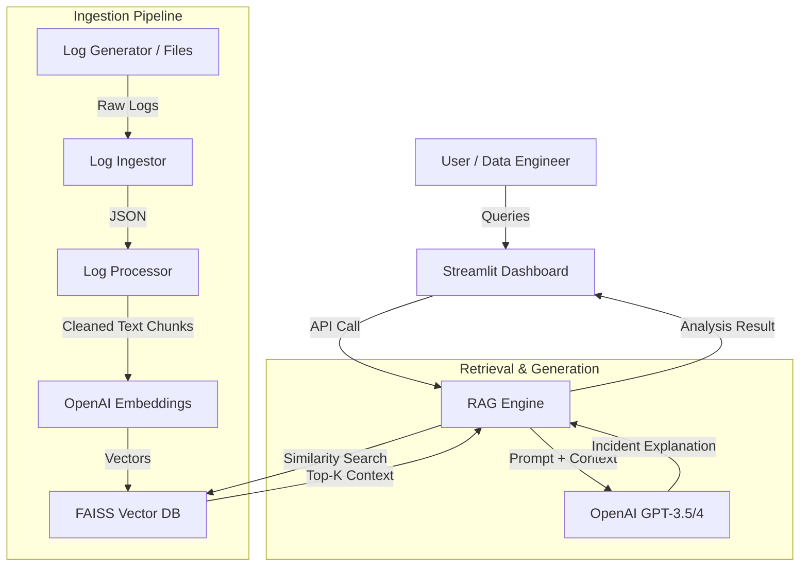

# LogSense-AI: Intelligent Log Analytics & Incident Assistant

**LogSense-AI** is a production-grade log analytics platform that leverages Generative AI (RAG) to perform semantic search and root-cause analysis on distributed system logs. Unlike traditional keyword-based search, LogSense-AI understands the context of incidents and provides natural language explanations.

## 🏗️ System Architecture



## 🚀 Features

- **Simulated Log Stream**: Generates realistic microservices logs (INFO, WARN, ERROR) with stack traces.
- **Semantic Ingestion**: Normalizes and chunks logs for efficient vector storage.
- **RAG-Powered Search**: Ask "Why did checkout fail?" instead of grepping for `Error 500`.
- **Automated Root Cause Analysis**: Uses LLMs to explain technical failures in plain English.
- **Interactive Dashboard**: Built with Streamlit for real-time investigation.

## 🛠️ Tech Stack

- **Language**: Python 3.10+
- **Frontend**: Streamlit
- **LLM & Embeddings**: OpenAI API (LangChain)
- **Vector Database**: FAISS
- **Containerization**: Docker

## 📦 Installation & Setup

### Prerequisites
- Python 3.10+ OR Docker
- OpenAI API Key

### Option 1: Local Setup

1. **Clone the repository**
   ```bash
   git clone https://github.com/deekshith8900/LogSense-AI.git
   cd LogSense-AI
   ```

2. **Set up Environment**
   ```bash
   python3 -m venv .venv
   source .venv/bin/activate
   pip install -r logsense_ai/requirements.txt
   ```

3. **Configure API Key**
   ```bash
   export OPENAI_API_KEY="your-sk-key-here"
   ```

4. **Run the Application**
   ```bash
   ./run_ui.sh
   ```

### Option 2: Docker Setup

1. **Build the Image**
   ```bash
   docker build -t logsense-ai .
   ```

2. **Run the Container**
   ```bash
   docker run -p 8501:8501 -e OPENAI_API_KEY="your-sk-key-here" logsense-ai
   ```

## 📖 Usage Guide

1. **Generate Data**: The app comes with a built-in log generator. If starting fresh, you can run:
   ```bash
   python logsense_ai/generate_logs.py
   ```
   (Or use the **"Run Ingestion"** button in the UI sidebar).

2. **Ingest Logs**: In the UI sidebar, click **"Run Ingestion Pipeline"**. This processes the raw logs and builds the FAISS index.

3. **Analyze**: In the main search bar, type a query like:
   - *"Why is the payment gateway failing?"*
   - *"Show me all connection errors in the inventory DB."*

4. **Review**: Read the AI-generated analysis and inspect the raw log chunks provided as evidence.

---
*Created by Deekshith Alampally*
